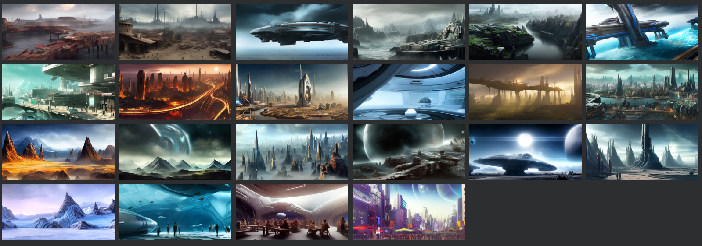

# EndlessSky_Artwork

This repository contains artwork for Endless Sky. 
 
Images are created using the Stable Diffusion text-to-image AI, in my case I used the "EasyDiffuse" package with a one-click installer for beginners.
 
Planet images are in 720x360 resolution in PNG format. This makes it easier to modify certain images than JPG.

To include images into the game I recommend to convert them to JPG for smaller file size. I compressed files from ~400k PNG to ~90k JPG with 92% JPG-quality.
 
All images in this repository contain TXT sidecar files with the Stable Diffusion settings that were used to create the images. You can use this information to create similar images on your own (on the first images I made I did not enable the setting to create sidecar files so there are some missing)
  
Unfortunately the file naming convention in Stable Diffusion begins with similar info, therefore I recommend to download the repository and browse the files with a decent file manager.
 
Have fun creating new planets and enhance this great game even more!
